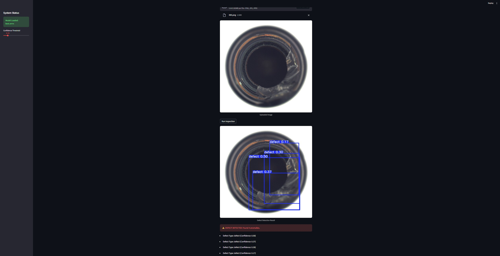

# 🏭 End-to-End Visual Quality Control System (MLOps)


> **A real-time, automated defect detection pipeline for manufacturing lines, simulating an Edge AI deployment workflow.**

---

## 📖 Project Overview

In high-throughput manufacturing (e.g., bottling plants), manual visual inspection is slow, error-prone, and expensive. This project automates Quality Control (QC) using Computer Vision to detect defects (such as broken glass, scratches, or contamination) in real-time.

The system is engineered as a complete **MLOps pipeline**, moving from raw data ingestion to a deployable **Edge-optimized model** capable of running on low-power CPU devices (simulating factory hardware).

### 🎯 Business Value
* **Reduced Waste:** Detects defects early in the pipeline, preventing faulty products from shipping.
* **Lower Latency:** Optimized ONNX inference (<100ms) allows for high-speed line processing.
* **Traceability:** Full experiment tracking via MLflow ensures model governance and reproducibility.

---

## 🏗️ System Architecture

The project follows a standard MLOps lifecycle:

1.  **Data Engineering:** Automated pipeline to convert MVTec AD segmentation masks into YOLO bounding boxes.
2.  **Model Training:** Fine-tuning YOLOv8n (Nano) on the "Bottle" dataset.
3.  **Experiment Tracking:** Logging parameters, metrics, and artifacts to MLflow.
4.  **Model Optimization:** Exporting the trained model to **ONNX** format for platform-agnostic deployment.
5.  **Deployment:** Serving the model via a **Streamlit** dashboard for operator visualization.

---

## 📊 Performance Metrics

The model was trained for 50 epochs on the MVTec AD (Bottle) dataset.

| Metric | Value | Description |
| :--- | :--- | :--- |
| **mAP@50** | **78.9%** | Mean Average Precision at 0.5 IoU threshold. |
| **Precision** | **91.7%** | High precision minimizes false positives (scrapping good bottles). |
| **Recall** | **61.5%** | Ability to detect actual defects. |
| **Inference Speed** | **~85ms** | Average time per image on a standard CPU (ONNX Runtime). |

> *Note: Performance can be further improved by increasing dataset size or training epochs.*

---

## 📸 Demo

### Factory Operator Dashboard
The interface allows operators to upload samples and see real-time inference results with confidence scores.



---

## 🛠️ Tech Stack

* **Language:** Python 3.10+
* **Computer Vision:** Ultralytics YOLOv8, OpenCV, NumPy
* **MLOps & Tracking:** MLflow
* **Edge Optimization:** ONNX, ONNX Runtime
* **Web App:** Streamlit
* **Data:** MVTec Anomaly Detection Dataset (Bottle Category)

---

## 🚀 Installation & Setup

Follow these steps to reproduce the environment locally.

### 1. Clone the Repository
```bash
git clone [https://github.com/fauzan111/visual-qc-mlops.git](https://github.com/fauzan111/visual-qc-mlops.git)
cd visual-qc-mlops
